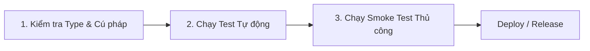

# TÀI LIỆU KỊCH BẢN KIỂM THỬ HỆ THỐNG E-LEARNING
## (World Trading Lab E-Learning - Test Scenarios & Regression Checklist)

> **Mục đích:** Tài liệu này chuẩn hóa toàn bộ các kịch bản kiểm thử (Test Scenarios & Test Cases) cho nền tảng World Trading Lab E-Learning. Mỗi khi nâng cấp hệ thống, refactor mã nguồn hoặc thêm tính năng mới, đội ngũ phát triển và kiểm thử cần thực hiện kiểm tra theo checklist này để đảm bảo hệ thống không phát sinh lỗi hồi quy (regression bugs).

---

## BẢNG TỔNG HỢP CÁC PHÂN HỆ KIỂM THỬ

| Mã Phân Hệ | Tên Phân Hệ Nghiệp Vụ | Mức Độ Ưu Tiên | Số Lượng Test Cases |
| :--- | :--- | :--- | :--- |
| **AUTH** | Xác thực & Phân quyền (Authentication & RBAC) | P0 (Bắt buộc) | 5 Cases |
| **CAT** | Danh mục & Khám phá Khóa học (Catalog & Preview) | P1 (Cao) | 4 Cases |
| **ORD** | Đặt hàng, Mã giảm giá & Thanh toán VietQR | P0 (Bắt buộc) | 6 Cases |
| **ENR** | Phê duyệt & Kích hoạt Quyền học viên (Enrollment) | P0 (Bắt buộc) | 4 Cases |
| **LMS** | Trải nghiệm Học tập & Lưu tiến độ (LMS Player) | P0 (Bắt buộc) | 5 Cases |
| **ADM** | Quản trị Khóa học, Học viên & Cài đặt (Admin CMS) | P1 (Cao) | 5 Cases |
| **I18N** | Đa ngôn ngữ & Giao diện Responsive | P2 (Trung bình) | 3 Cases |

---

## CHI TIẾT CÁC KỊCH BẢN KIỂM THỬ (TEST CASES)

### 1. PHÂN HỆ AUTH: XÁC THỰC & PHÂN QUYỀN

#### TC-AUTH-01: Đăng ký tài khoản học viên mới
* **Mục tiêu:** Đảm bảo người dùng có thể tạo tài khoản mới thành công và mật khẩu được mã hóa an toàn.
* **Tiền điều kiện:** Chưa đăng nhập.
* **Các bước thực hiện:**
  1. Truy cập trang `/auth/register`.
  2. Nhập Họ và tên: `Nguyễn Văn Test`.
  3. Nhập Email: `test_user_01@example.com`.
  4. Nhập Mật khẩu: `Password123@`.
  5. Bấm nút "Đăng ký".
* **Kết quả kỳ vọng:**
  - Hệ thống tạo tài khoản trong bảng `User` với `role = "STUDENT"`, `status = "ACTIVE"`.
  - Cột `passwordHash` trong database được mã hóa bcrypt (không lưu plain text).
  - Tự động đăng nhập hoặc chuyển hướng người dùng đến trang chủ/trang đăng nhập với thông báo thành công.
* **Trường hợp ngoại lệ (Edge Cases):**
  - Đăng ký email trùng lặp -> Báo lỗi: "Email đã được sử dụng".
  - Mật khẩu dưới 6 ký tự hoặc email sai định dạng -> Validate chặn ngay tại form.

#### TC-AUTH-02: Đăng nhập hệ thống (Credentials Login)
* **Mục tiêu:** Xác thực tài khoản với NextAuth.
* **Các bước thực hiện:**
  1. Truy cập `/auth/login`.
  2. Nhập Email và Mật khẩu vừa tạo.
  3. Bấm "Đăng nhập".
* **Kết quả kỳ vọng:**
  - Đăng nhập thành công, session cookie `next-auth.session-token` được thiết lập.
  - Header cập nhật hiển thị Avatar, Tên người dùng và nút "Đăng xuất".

#### TC-AUTH-03: Kiểm soát phân quyền truy cập (RBAC Protection)
* **Mục tiêu:** Ngăn chặn người dùng trái phép truy cập khu vực Admin.
* **Các bước thực hiện:**
  1. Đăng nhập bằng tài khoản role `STUDENT`.
  2. Cố tình gõ trực tiếp URL `/admin` hoặc `/admin/courses` trên thanh địa chỉ trình duyệt.
* **Kết quả kỳ vọng:**
  - Hệ thống chặn truy cập, chuyển hướng về trang chủ (`/`) hoặc trang báo lỗi 403 Forbidden.
  - Không để lộ bất kỳ API hay dữ liệu thống kê nào của Admin.

---

### 2. PHÂN HỆ CAT: DANH MỤC & TRẢI NGHIỆM XEM KHÓA HỌC

#### TC-CAT-01: Tìm kiếm & Lọc khóa học
* **Mục tiêu:** Học viên tìm kiếm được khóa học theo nhu cầu.
* **Các bước thực hiện:**
  1. Truy cập `/courses`.
  2. Chọn lọc theo Category (ví dụ: "Forex", "Crypto").
  3. Gõ từ khóa tìm kiếm trên ô Search.
* **Kết quả kỳ vọng:**
  - Danh sách khóa học được lọc chính xác theo danh mục và từ khóa.
  - Khóa học ở trạng thái `DRAFT` tuyệt đối không hiển thị ở trang công khai (chỉ hiển thị khóa học `PUBLISHED`).

#### TC-CAT-02: Quyền truy cập bài học thử (Trial Lesson vs Locked Lesson)
* **Mục tiêu:** Đảm bảo cơ chế Preview hoạt động đúng và an toàn.
* **Tiền điều kiện:** Người dùng chưa mua khóa học (hoặc chưa đăng nhập).
* **Các bước thực hiện:**
  1. Truy cập trang chi tiết khóa học `/courses/[slug]`.
  2. Bấm vào bài học có nhãn "Học thử" (`isPreview: true`).
  3. Bấm vào bài học thông thường (`isPreview: false`).
* **Kết quả kỳ vọng:**
  - Bài học thử: Trình phát cho phép xem video bài giảng.
  - Bài học thông thường: Hiển thị biểu tượng ổ khóa 🔒, video bị ẩn, hiển thị thông báo "Bạn cần đăng ký khóa học để xem nội dung này" kèm nút dẫn tới trang Đặt hàng.

---

### 3. PHÂN HỆ ORD: ĐẶT HÀNG, MÃ GIẢM GIÁ & VIETQR

#### TC-PAY-01: Tạo đơn hàng khóa học trả phí
* **Mục tiêu:** Tạo đơn hàng hợp lệ với mã đơn chuẩn hóa.
* **Tiền điều kiện:** Học viên đã đăng nhập.
* **Các bước thực hiện:**
  1. Tại trang chi tiết khóa học, bấm "Đăng ký ngay" (hoặc "Mua ngay").
  2. Chuyển đến trang thanh toán `/checkout/[slug]`.
* **Kết quả kỳ vọng:**
  - Hệ thống gọi API `POST /api/orders/create`.
  - Sinh mã đơn hàng theo format `EL-[TIMESTAMP]-[HASH]` (ví dụ: `EL-M3K4J8-A1B2C3D4`).
  - Trạng thái đơn hàng khởi tạo là `PENDING`.
  - Nếu học viên đã sở hữu khóa học (`ACTIVE`), hệ thống thông báo lỗi "Bạn đã sở hữu khóa học này" và không cho tạo đơn trùng lặp.

#### TC-PAY-02: Áp dụng mã giảm giá (Coupon)
* **Mục tiêu:** Tính toán chính xác giá tiền sau giảm giá.
* **Các bước thực hiện:**
  1. Nhập mã coupon hợp lệ (loại `PERCENT` 20% hoặc `FIXED_AMOUNT` 200.000đ).
  2. Bấm "Áp dụng".
* **Kết quả kỳ vọng:**
  - Số tiền giảm (`discountAmount`) và tổng thanh toán cuối (`finalAmount`) tính toán chính xác.
  - Số tiền thanh toán không được âm (`Math.max(0, originalPrice - discountAmount)`).
* **Trường hợp ngoại lệ (Edge Cases):**
  - Nhập mã hết hạn (`expiresAt < now`) -> Báo lỗi "Mã giảm giá đã hết hạn".
  - Nhập mã đã dùng hết số lượt (`usedCount >= maxUsage`) -> Báo lỗi "Mã đã hết lượt sử dụng".
  - Tổng giá trị đơn thấp hơn `minOrderValue` của coupon -> Báo lỗi yêu cầu giá trị tối thiểu.

#### TC-PAY-03: Hiển thị mã QR VietQR QuickPay
* **Mục tiêu:** Tạo ảnh QR VietQR chuẩn để khách hàng quét app ngân hàng.
* **Các bước thực hiện:**
  1. Sau khi đơn hàng được tạo, kiểm tra hình ảnh mã QR hiển thị trên màn hình thanh toán.
* **Kết quả kỳ vọng:**
  - URL ảnh gọi đúng định dạng API VietQR: `https://img.vietqr.io/image/<BANK>-<ACCOUNT>-compact2.png?...`
  - Số tiền trên QR khớp 100% với `finalAmount`.
  - Nội dung chuyển khoản trên QR chứa đúng mã đơn hàng `EL-...` để phục vụ đối soát tự động.
  - Tên chủ tài khoản và số tài khoản hiển thị đúng theo cấu hình trong Settings.

#### TC-PAY-04: Tải ảnh minh chứng thanh toán
* **Mục tiêu:** Học viên gửi ảnh biên lai ngân hàng cho Admin đối soát.
* **Các bước thực hiện:**
  1. Tại màn hình hướng dẫn chuyển khoản, chọn tệp ảnh biên lai chuyển tiền.
  2. Bấm "Xác nhận đã chuyển khoản".
* **Kết quả kỳ vọng:**
  - Ảnh được tải lên thành công, cập nhật cột `proofImageUrl` trong đơn hàng.
  - Màn hình chuyển sang trạng thái "Đang chờ quản trị viên xác nhận".

---

### 4. PHÂN HỆ ENR: PHÊ DUYỆT & KÍCH HOẠT QUYỀN HỌC VIÊN

#### TC-ENR-01: Admin phê duyệt đơn hàng (Order Approval)
* **Mục tiêu:** Kích hoạt quyền vào học cho học viên sau khi kiểm tra biên lai.
* **Tiền điều kiện:** Đăng nhập tài khoản `ADMIN`.
* **Các bước thực hiện:**
  1. Truy cập `/admin/orders`.
  2. Chọn đơn hàng đang ở trạng thái `PENDING`.
  3. Xem ảnh minh chứng thanh toán, đối soát nội dung và số tiền.
  4. Bấm "Duyệt đơn" (Approve).
* **Kết quả kỳ vọng:**
  - Trạng thái đơn hàng đổi thành `COMPLETED`.
  - Hệ thống tự động tạo (hoặc cập nhật) bản ghi trong bảng `Enrollment` cho `userId` và `courseId` với `status = "ACTIVE"`.
  - Học viên đăng nhập vào có thể truy cập ngay vào toàn bộ bài giảng của khóa học.

#### TC-ENR-02: Admin gán khóa học thủ công (Manual Enrollment)
* **Mục tiêu:** Cho phép Admin cấp quyền vào học trực tiếp cho học viên mà không cần qua giỏ hàng.
* **Các bước thực hiện:**
  1. Truy cập `/admin/students` hoặc `/admin/courses`.
  2. Chọn tính năng "Gán học viên" (`/api/admin/enrollments/manual`).
  3. Nhập email học viên và chọn khóa học.
  4. Bấm "Cấp quyền".
* **Kết quả kỳ vọng:**
  - Nếu email tồn tại trong hệ thống -> Tạo bản ghi `Enrollment` thành công.
  - Nếu email chưa có tài khoản -> Trả thông báo lỗi rõ ràng yêu cầu học viên đăng ký tài khoản trước.

---

### 5. PHÂN HỆ LMS: TRẢI NGHIỆM HỌC TẬP & THEO DÕI TIẾN ĐỘ

#### TC-LMS-01: Trình phát bài học (Video Player & Article Viewer)
* **Mục tiêu:** Học viên xem được nội dung bài giảng một cách mượt mà.
* **Tiền điều kiện:** Đã được kích hoạt khóa học (`Enrollment: ACTIVE`).
* **Các bước thực hiện:**
  1. Truy cập `/learn/[courseSlug]/[lessonSlug]`.
* **Kết quả kỳ vọng:**
  - Link YouTube được chuyển đổi qua hàm `getYouTubeEmbedUrl` để nhúng vào thẻ `<iframe>` chuẩn bảo mật.
  - Nếu bài học dạng bài viết/Markdown -> Render đúng định dạng chữ, code block, hình ảnh.
  - Cột danh sách bài học bên cạnh đánh dấu bài học hiện tại đang học (Active State).

#### TC-LMS-02: Đánh dấu hoàn thành bài học & Cập nhật tiến độ
* **Mục tiêu:** Lưu trạng thái đã hoàn thành bài học và tính toán % hoàn thành khóa học.
* **Các bước thực hiện:**
  1. Sau khi học xong bài học, bấm nút "Hoàn thành & Tiếp tục" (hoặc "Đánh dấu đã học").
* **Kết quả kỳ vọng:**
  - Gọi API `POST /api/progress/complete` thành công.
  - Bản ghi `LessonProgress` của học viên có `isCompleted = true`.
  - Thanh tiến độ (% Progress Bar) của khóa học tăng lên tương ứng theo công thức:
    $$\text{Tiến độ (\%)} = \frac{\text{Số bài đã hoàn thành}}{\text{Tổng số bài học}} \times 100$$
  - Biểu tượng tích xanh xuất hiện cạnh tên bài học trên thanh điều hướng.

---

### 6. PHÂN HỆ ADM: QUẢN TRỊ NỘI DUNG & HỆ THỐNG (ADMIN CMS)

#### TC-ADM-01: Quản lý Khóa học (CRUD Course)
* **Mục tiêu:** Admin tạo mới, chỉnh sửa thông tin, giá bán và cấu trúc khóa học.
* **Các bước thực hiện:**
  1. Truy cập `/admin/courses/new`.
  2. Điền thông tin: Tiêu đề, slug, danh mục, giá gốc, giá khuyến mãi, ảnh đại diện thumbnail.
  3. Thêm các Chương (Section) và Bài học (Lesson).
  4. Lưu khóa học và chuyển trạng thái sang `PUBLISHED`.
* **Kết quả kỳ vọng:**
  - Khóa học được lưu vào database với đầy đủ quan hệ Section và Lesson.
  - Khóa học xuất hiện ngay trên trang danh mục bên ngoài cho học viên xem.

#### TC-ADM-02: Cấu hình tài khoản ngân hàng nhận tiền
* **Mục tiêu:** Thay đổi thông tin số tài khoản MBBank/Vietcombank trong trang Admin.
* **Các bước thực hiện:**
  1. Truy cập `/admin/settings`.
  2. Thay đổi số tài khoản hoặc ngân hàng nhận tiền.
  3. Bấm "Lưu cài đặt".
* **Kết quả kỳ vọng:**
  - Cài đặt được lưu vào bảng `Setting`.
  - Mã QR VietQR sinh tại trang Checkout của khách hàng lập tức cập nhật theo số tài khoản mới.

---

### 7. PHÂN HỆ I18N: ĐA NGÔN NGỮ & GIAO DIỆN

#### TC-I18N-01: Chuyển đổi ngôn ngữ Tiếng Việt / Tiếng Anh
* **Mục tiêu:** Đảm bảo toàn bộ hệ thống hiển thị chính xác theo ngôn ngữ đã chọn.
* **Các bước thực hiện:**
  1. Tại Header, bấm vào bộ chọn ngôn ngữ (Language Switcher).
  2. Chuyển đổi giữa `VI` (Tiếng Việt) và `EN` (English).
* **Kết quả kỳ vọng:**
  - Toàn bộ menu, tiêu đề, nút bấm, thông báo toast chuyển ngữ tương ứng.
  - Không có chuỗi nào bị lỗi hiển thị mã khóa (ví dụ: `undefined` hoặc `auth.login.title`).
  - Lựa chọn ngôn ngữ được lưu vào cookie/localStorage để giữ nguyên khi tải lại trang.

---

## QUY TRÌNH THỰC HIỆN KIỂM THỬ KHI CÓ THAY ĐỔI MÃ NGUỒN

Khi nâng cấp thư viện, sửa lỗi hoặc thêm tính năng mới, quy trình kiểm thử bắt buộc gồm 3 bước:



1. **Bước 1: Kiểm tra Type & Lint:**
   ```bash
   npx tsc --noEmit
   npm run lint
   ```
2. **Bước 2: Chạy bộ kiểm thử tự động:**
   ```bash
   npm run test
   ```
3. **Bước 3: Chạy Smoke Test thủ công (5 phút):**
   - Đăng nhập tài khoản Student và Admin.
   - Thử luồng tạo đơn hàng và kiểm tra hiển thị mã QR VietQR.
   - Bấm vào bài học trong khóa học đã sở hữu và kiểm tra lưu tiến độ.
